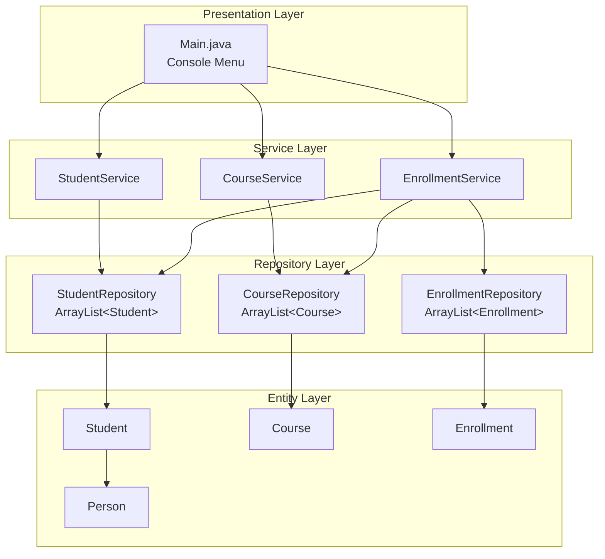
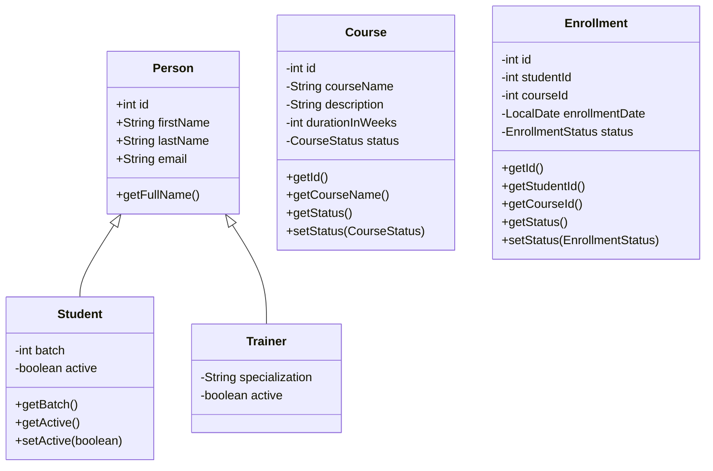
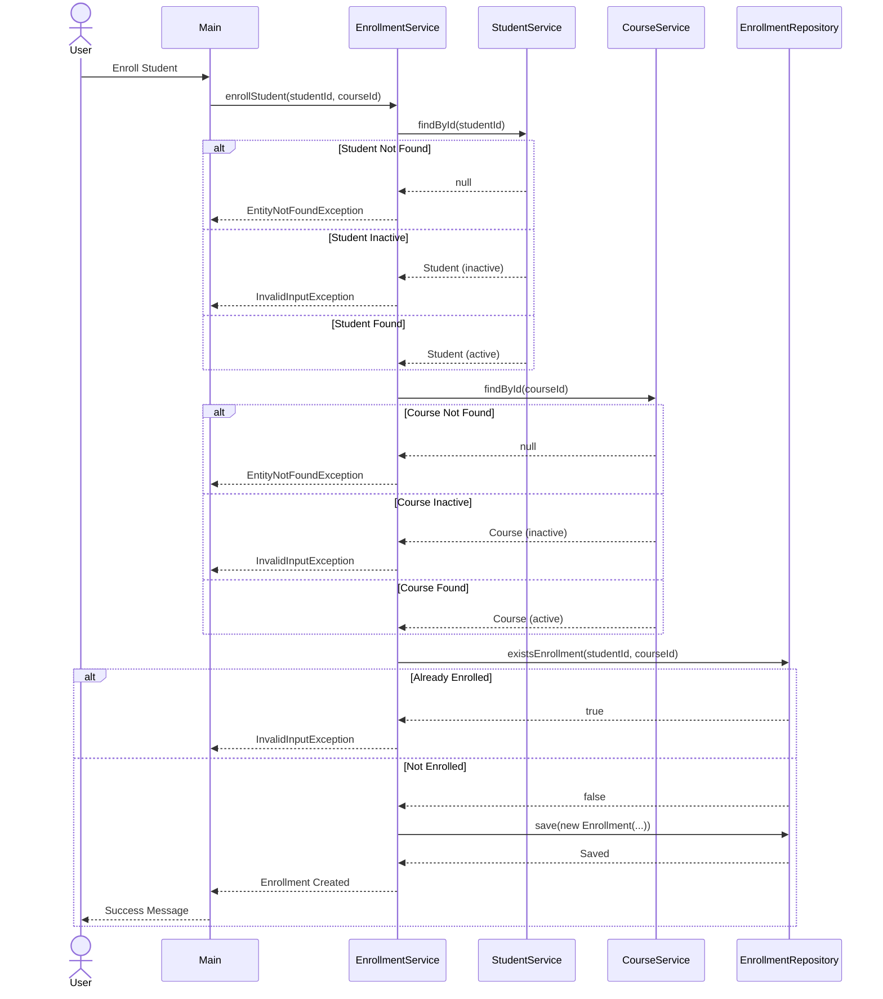

# LearnTrack - Learning Management System

A console-based Learning Management System (LMS) built in Java for managing students, courses, and enrollments.

## Features

- **Student Management**: Add, view, search, activate/deactivate students
- **Course Management**: Add, view, activate/deactivate courses
- **Enrollment Management**: Enroll students, complete/cancel enrollments
- **In-Memory Storage**: All data stored in ArrayLists (no database required)

## Project Structure

```
src/com/airtribe/learntrack/
├── entity/          # Domain models (Student, Course, Enrollment, Person, Trainer)
├── enums/           # Status enums (CourseStatus, EnrollmentStatus)
├── exception/       # Custom exceptions (EntityNotFoundException, InvalidInputException)
├── repository/      # Data access layer (in-memory storage)
├── service/         # Business logic layer
├── util/            # Utilities (IdGenerator, InputValidator)
├── constants/       # App constants and menu options
└── ui/              # Main.java (console UI entry point)
```

## Architecture

### Layered Architecture Flow



### Class Hierarchy



### Enrollment Flow



## Menu Options

### Main Menu
```
1. Student Management
2. Course Management
3. Enrollment Management
Exit to quit
```

### Student Management
```
1. Add Student
2. View All Students
3. Search by ID
4. Deactivate Student
5. Activate Student
0. Back to Main Menu
```

### Course Management
```
1. Add Course
2. View All Courses
3. Activate Course
4. Deactivate Course
0. Back to Main Menu
```

### Enrollment Management
```
1. Enroll Student
2. View Student Enrollments
3. Complete Enrollment
4. Cancel Enrollment
0. Back to Main Menu
```


## Validations

| Feature | Validation |
|---------|------------|
| Student | First/Last name required, email format, batch must be number |
| Course | Name required, duration > 0 weeks |
| Enrollment | Student must be active, Course must be active, No duplicate enrollments |
| IDs | Must be positive numbers |

## Status Enums

### CourseStatus
- `ACTIVE` - Course accepting enrollments
- `INACTIVE` - Course not accepting enrollments
- `DRAFT` - Reserved for future use

### EnrollmentStatus
- `PENDING` - Enrollment created, awaiting completion
- `APPROVED` - Reserved for future use
- `REJECTED` - Enrollment cancelled
- `COMPLETED` - Course completed by student

## Tech Stack

- **Language**: Java (JDK 17+)
- **Storage**: In-Memory (ArrayList)
- **Architecture**: Layered Architecture (Presentation → Service → Repository → Entity)
- **Design Patterns**: Inheritance (Person hierarchy)


